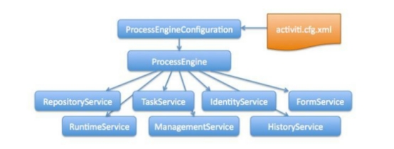

#### 1、概述

流程引擎主要用于业务流程管理，是一种以规范化的构造端到端的卓越业务流程为中心，以持续地提高组织业务绩效为目的的系统化方法。其特点是注重流程驱动为核心，实现端到端全流程信息化管理。

Activiti项目是一项新的基于Apache许可的开源BPM平台，从基础开始构建，旨在提供支持新的BPMN 2.0标准，包括支持对象管理组（OMG），面对新技术的机遇，诸如互操作性和云架构，提供技术实现。

创始人Tom Baeyens是JBoss jBPM的项目架构师，以及另一位架构师Joram Barrez，一起加入到创建Alfresco这项首次实现Apache开源许可的BPMN 2.0引擎开发中来。

Activiti是一个独立运作和经营的开源项目品牌，并将独立于Alfresco开源ECM系统运行。 Activiti将是一种轻量级，可嵌入的BPM引擎，而且还设计适用于可扩展的云架构。 Activiti将提供宽松的Apache许可2.0，以便这个项目可以广泛被使用，同时促进Activiti BPM引擎和BPMN 2.0的匹配，该项目现正由OMG通过标准审定。 加入Alfresco Activiti项目的是VMware的SpringSource分支，Alfresco的计划把该项目提交给Apache基础架构，希望吸引更多方面的BPM专家和促进BPM的创新

#### 2、原理与设计

将业务流程的每个节点读取到数据库中，这样每个节点（包括开始节点和结束节点）就是数据库中的一条记录，当发生业务流程的时候，不断的从业务流程图中读取下一个节点，其实就相当于操作节点对应的数据库记录，这样就实现流程管理和状态字段无关。

 

##### 内部核心机制

1、业务流程图要规范化，需要遵守一套标准。

2️、业务流程图本质上就是一个XML文件，而XML可以存放所要的数据。

3️、读取业务流程图的过程就是解析XML文件的过程。

4️、读取一个业务流程图的结点就相当于解析一个XML的结点，进一步将数据插入到MySQL表中，形成一条记录。

5️、将一个业务流程图的所有节点都读取并存入到MySQL表中。

6️、后面只要读取MySQL表中的记录就相当于读取业务流程图的一个节点。

7️、业务流程的推进，后面就转换为读取表中的数据，并且处理数据，结束的时候这一行数据就可以删除了。

##### BPM介绍

BPM（Business Process Management），即业务流程管理，是一种以规范化的构造端到端的卓越业务流程为中心，以持续地提高组织业务绩效为目的的系统化方法，常见商业管理教育如EMBA、MBA等均将BPM包含在内。

企业流程管理主要是对企业内部改革，改变企业管理机构重叠、中间层次多、流程不闭环等，做到机构不重叠、业务不复杂，达到缩短流程周期、节约运作资本、提高企业效益的作用。

##### BPMN介绍

BPMN（Business Process Model And Notation），业务流程模型和符号，是由BPMI（Business Process Management Initiative）开发的一套的业务流程建模符号，使用BPMN提供的符号可以创建业务流程。2004年5月发布了BPMN1.0规范。BPMI于2005年9月并入OMG（The Object Management Group，对象管理组织）组织。OMG于2011年1月发布BPMN2.0的最终版本。

 BPMN是目前被各BPM厂商广泛接受的BPM标准。Activit就是使用BPMN2.0进行流程建模、流程执行管理，它包括很多的建模符号。

 

 

#### 3、功能与作用

工作流程模块的详细功能要求，包含且不限以下内容

 

| 一级目录     | 二级目录     | 功能描述                                                     |
| ------------ | ------------ | ------------------------------------------------------------ |
| 流程分类管理 | 流程管理     | 流程分类的管理，模型的创建发布管理，以及流程配置和挂起激活管理。 |
|              | 模型管理     |                                                              |
|              | 流程管理     |                                                              |
| 流程列表     | 我的申请     | 根据不同的条件查看流程列表，并进行流程的操作。               |
|              | 我的待办     |                                                              |
|              | 我的已办     |                                                              |
|              | 运行中的流程 |                                                              |
|              | 已结束的流程 |                                                              |

 

（流程服务架构图）

 

#### 3、必要性

1、提高安全性：在工作流应用系统中，每个参与者只看到工组流引擎指派给他自己的这些任务。参与者的访问被每个过程中每个活动的指派规则所控制。

2、增强反应能力：通过消除一个活动与下一个活动之间的手工活动，工作流系统可以减少服务处理和它成功完成的时间。

3、提供清晰的进度报告：工作流应用系统提供详细的处理报告，包括正在处理的活动、它们的状态和涉及和责任人，以及一个要被实现的余下活动的视图。所有的报告在几秒钟内可以得到。客户和企业的成员可以得到服务处理状态的确切信息。

4、提高生产效率：通过控制活动计划和指派，工作流消除了大多数的监督管理任务。通过使用工作流，用户能够看到需要被完成的活动列表。一旦他选择了一个活动，所有和这个活动相关的文档和表格自动地出现在工作站上；在活动完成之后，实现期间创建的信息自动地归档在适当的位置。

5、具有较好的质量和成本控制：工作流应用系统保存了它控制的所有事件的日志，包括日期和时间、相关的任务和参与者的名称。日志中的信息包括每个活动的成本、进度以及过程本身性能的报告。