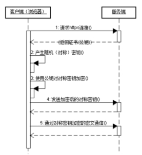

#### 1、SSL概述

安全套接字（Secure Socket Layer，SSL）协议是Web浏览器与Web服务器之间安全交换信息的协议，提供两个基本的安全服务：鉴别与保密。

SSL是Netscape于1994年开发的，后来成为了世界上最著名的web安全机制，所有主要的浏览器都支持SSL协议

##### HTTPS简介

超文本传输安全协议（英语：Hypertext Transfer Protocol Secure，缩写：HTTPS，常称为HTTP over TLS，HTTP over SSL或HTTP Secure）是一种网络安全传输协议。

常见的HTTP就是我们平时浏览网页时候使用的一种协议。HTTP协议传输的数据都是未加密的，也就是明文，因此使用HTTP协议传输隐私信息非常不安全。HTTP使用80端口通讯，而HTTPS占用443端口通讯。在计算机网络上，HTTPS经由超文本传输协议（HTTP）进行通信，但利用SSL/TLS来加密数据包。HTTPS的主要目的，是提供对网络服务器的身份认证，保护交换数据的隐私与完整性。

 

#### 2、HTTPS工作原理

HTTPS在传输数据之前需要客户端（浏览器）与服务端（网站）之间进行一次握手，在握手过程中将确立双方加密传输数据的密码信息。TLS/SSL协议是一套加密传输的协议，TLS/SSL中使用了非对称加密，对称加密以及HASH算法。握手过程的具体描述如下：

（1）浏览器将自己支持的一套加密规则发送给网站。 

（ 2）网站从中选出一组加密算法与HASH算法，并将自己的身份信息以证书的形式发回给浏览器。证书里面包含了网站地址，加密公钥，以及证书的颁发机构等信息。 

（3）浏览器获得网站证书之后浏览器要做以下工作：

​	a)验证证书的合法性（颁发证书的机构是否合法，证书中包含的网站地址是否与正在访问的地址一致等），如果证书受信任，则浏览器栏里面会显示一个小锁头，否则会给出证书不受信的提示。 

​	b)如果证书受信任，或者是用户接受了不受信的证书，浏览器会生成一串随机数的密码，并用证书中提供的公钥加密。 

​	c)使用约定好的HASH算法计算握手消息，并使用生成的随机数对消息进行加密，最后将之前生成的所有信息发送给网站。 

（ 4）网站接收浏览器发来的数据之后要做以下的操作： 


a) 使用自己的私钥将信息解密取出密码，使用密码解密浏览器发来的握手消息，并验证HASH是否与浏览器发来的一致。 

b) 使用密码加密一段握手消息，发送给浏览器。 

（5）浏览器解密并计算握手消息的HASH，如果与服务端发来的HASH一致，此时握手过程结束，之后所有的通信数据将由之前浏览器生成的随机密码并利用对称加密算法进行加密。

 

HTTPS对应的通信时序图如下：

 

 

#### 3、SSL证书的必要性

- 机密性：加密处理，加密数据以防止数据中途被窃取；

- 完整性：维护数据的完整性，确保数据在传输过程中不被改变；

- 认证性：实体认证服务，认证客户端（可选）和服务器，确保数据发送到正确的客户端（可选）和服务器。