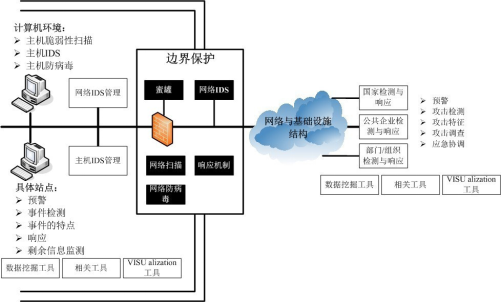

## 系统安全架构设计

### 1 物理安全

 物理安全是整个计算机网络系统安全的前提，是保护计算机网络设备、设施以及其他媒体免遭地震、水灾、火灾等环境事故、人为操作失误或各种计算机犯罪行为导致的破坏的过程。

物理安全主要考虑的问题是环境、场地和设备的安全及物理访问控制和应急处置计划等。物理安全在整个计算机网络信息系统安全中占有重要地位。

#### 1.1 物理访问控制

（1）机房出入口应安排专人值守，控制、鉴别和记录进入的人员。

（2）需进入机房的来访人员应经过申请和审批流程，并限制和监控其活动范围。

（3）应对机房划分区域进行管理，区域和区域之间设置物理隔离装置，在重要区域前设置交付或安装等过渡区域。

（4）重要区域应配置电子门禁系统，控制、鉴别和记录进入的人员。

 

#### 1.2 防盗窃和防破坏

（1）应将主要设备放置在机房内。

（2）应将设备或主要部件进行固定，并设置明显的不易除去的标记。 

（3）应将通信线缆铺设在隐蔽处，可铺设在地下或管道中。

（4）应对介质分类标识，存储在介质库或档案室中。

（5）应利用光、电等技术设置机房防盗报警系统；

（6）应对机房设置监控报警系统。

 

#### 1.3 防雷击

（1）机房建筑应设置避雷装置。

（2）应设置防雷保安器，防止感应雷。

（3）机房应设置交流电源地线。

 

#### 1.4 防静电

（1）主要设备应采用必要地接地防静电措施；

（2）机房应采用防静电地板。 

 

#### 1.5 温湿度控制

（1）机房应设置温、湿度自动调节设施，使机房温、湿度的变化在设备运行所允许的范围之内。

#### 1.6 电力供应

（1）应在机房供电线路上配置稳压器和过电压防护设备。

（2）应提供短期的备用电力供应，至少满足主要设备在断电情况下的正常运行要求。

（3）应设置冗余或并行的电力电缆线路为计算机系统供电。

（4）应建立备用供电系统。

### 2 网络安全

 网络安全概述

在使用系统的过程中，浏览器、手机客户端与服务平台服务端的通讯数据应加密传输，能够防窃听、防篡改、防冒充、防抵赖等问题。

用户通过Internet接入系统平台或者访问APP客户端，所有这些连接都对安全提出了极高的要求。系统平台充分考虑了基于各种策略的安全措施，为系统的连接和应用提供了全面的安全保障：

l 安全检测和监控：通过防火墙、入侵检测系统防止来自网络的恶意攻击和入侵破坏，形成系统运行的安全环境。管理员可以通过配置多种安全措施，实现对恶意攻击和入侵的检测、自动阻塞和告警处理，有效地控制来自外网的安全破坏。

l 端到端连接安全：通过使用SSL（安全套接字层）、IP限制、口令加密等多种手段，对系统和应用业务需要的连接和访问进行有效地控制，防止了IPSpoof等多种攻击，为业务和系统运行提供了安全的技术保障。

l 多级权限管理：系统支持包括系统管理、接入层管理、服务层管理、应用层管理和合作方管理等多种权限，同时系统根据客户的业务要求可以定义多种其他的权限，各级管理员通过不同的权限来访问和管理不同的模块和功能，为系统和业务的管理提供了良好的管理权限控制保障。

 

 

 

#### 2.1 结构安全

（1）应保证主要网络设备的业务处理能力具备冗余空间，满足业务高峰期需要；

（2）应保证网络各个部分的带宽满足业务高峰期需要；

（3）应在业务终端与业务服务器之间进行路由控制建立安全的访问路径；

（4）应绘制与当前运行情况相符的网络拓扑结构图；

（5）应根据各部门的工作职能、重要性和所涉及信息的重要程度等因素，划分不同的子网或网段，并按照方便管理和控制的原则为各子网、网段分配地址段；

（6）应避免将重要网段部署在网络边界处且直接连接外部信息系统，重要网段与其他网段之间采取可靠的技术隔离手段；

（7）应按照对业务服务的重要次序来指定带宽分配优先级别，保证在网络发生拥堵的时候优先保护重要主机。 

#### 2.2 访问控制

（1）应在网络边界部署访问控制设备，启用访问控制功能；

（2）应能根据会话状态信息为数据流提供明确的允许/拒绝访问的能力，控制粒度为端口级；

（3）应对进出网络的信息内容进行过滤，实现对应用层HTTP、FTP、TELNET、SMTP、POP3等协议命令级的控制；

（4）应在会话处于非活跃一定时间或会话结束后终止网络连接；

（5）应限制网络最大流量数及网络连接数；

（6）重要网段应采取技术手段防止地址欺骗；

（7）应按用户和系统之间的允许访问规则，决定允许或拒绝用户对受控系统进行资源访问，控制粒度为单个用户；

（8）应限制具有拨号访问权限的用户数量。

 

#### 2.3 安全审计

（1）应对网络系统中的网络设备运行状况、网络流量、用户行为等进行日志记录；

（2）审计记录应包括：事件的日期和时间、用户、事件类型、事件是否成功及其他与审计相关的信息；

（3）应能够根据记录数据进行分析，并生成审计报表；

（4）应对审计记录进行保护，避免受到未预期的删除、修改或覆盖等。

 

#### 2.4 边界完整性检查

（1）应能够对非授权设备私自联到内部网络的行为进行检查，准确定出位置，并对其进行有效阻断；

（2）应能够对内部网络用户私自联到外部网络的行为进行检查，准确定出位置，并对其进行有效阻断

 

#### 2.5 入侵防范

（1）应在网络边界处监视以下攻击行为：端口扫描、强力攻击、木马后门攻击、拒绝服务攻击、缓冲区溢出攻击、IP碎片攻击和网络蠕虫攻击等；

（2）当检测到攻击行为时，记录攻击源IP、攻击类型、攻击目的、攻击时间，在发生严重入侵事件时应提供报警

（4）应遵循最小安装的原则，仅安装需要的组件和应用程序。

（5）通过设定终端接入方式或网络地址范围对通过网络进行管理的管理终端进行限制。

 

#### 2.6 恶意代码防范

（1）应在网络边界处对恶意代码进行检测和清除；

（2）应维护恶意代码库的升级和检测系统的更新

 

#### 2.7 网络设备防护

（1）应对登录网络设备的用户进行身份鉴别；

（2）应对网络设备的管理员登录地址进行限制；

（3）网络设备用户的标识应唯一；

（4）主要网络设备应对同一用户选择两种或两种以上组合的鉴别技术来进行身份鉴别；

（5）身份鉴别信息应具有不易被冒用的特点，口令应有复杂度要求并定期更换；

（6）应具有登录失败处理功能，可采取结束会话、限制非法登录次数和当网络登录连接超时自动退出等措施；

（7）当对网络设备进行远程管理时，应采取必要措施防止鉴别信息在网络传输过程中被窃听；

（8）应实现设备特权用户的权限分离。

 

### 3 主机安全

主机安全概述：

其核心内容包括安全[应用交付系统](https://baike.baidu.com/item/应用交付系统/14720421)、应用监管系统、操作系统安全增强系统和[运维](https://baike.baidu.com/item/运维/8253097)安全管控系统。它的具体功能是指保证主机在[数据存储](https://baike.baidu.com/item/数据存储/9827490)和处理的保密性、完整性，可用性，它包括硬件、固件、系统软件的自身安全，以及一系列附加的安全技术和安全管理措施，从而建立一个完整的主机安全保护环境。

 

#### 3.1 身份鉴别

（1）应对登录操作系统和数据库系统的用户进行身份标识和鉴别；

（2）操作系统和数据库系统管理用户身份标识应具有不易被冒用的特点，口令应有复杂度要求并定期更换；

（3）应启用登录失败处理功能，可采取结束会话、限制非法登录次数和自动退出等措施；

（4）当对服务器进行远程管理时，应采取必要措施，防止鉴别信息在网络传输过程中被窃听；

（5）应为操作系统和数据库系统的不同用户分配不同的用户名，确保用户名具有唯一性。

（6）应采用两种或两种以上组合的鉴别技术对管理用户进行身份鉴别

 

#### 3.2 访问控制

（1）应启用访问控制功能，依据安全策略控制用户对资源的访问；

（2）应根据管理用户的角色分配权限，实现管理用户的权限分离，仅授予管理用户所需的最小权限；

（3）实现操作系统和数据库系统特权用户的权限分离；

（4）应严格限制默认帐户的访问权限，重命名系统默认帐户，修改这些账户的默认口令；

（5）应及时删除多余的、过期的账户，避免共享账户的存在。

（6）应对重要信息资源设置敏感标记；

（7）应依据安全策略严格控制用户对有敏感标记重要信息资源的操作；

 

#### 3.3 安全审计

（1）审计范围应覆盖到服务器和重要客户端上的每个操作系统用户和数据库用户；

（2）审计内容应包括重要用户行为、系统资源的异常使用和重要系统命令的使用等系统内重要的安全相关事件；

（3）审计记录应包括事件的日期、时间、类型、主体标识、客体标识和结果等； 

（4）应能够根据记录数据进行分析，并生成审计报表；

（5）应保护审计进程，避免受到未预期的中断；

（6）应保护审计记录，避免受到未预期的删除、修改或覆盖等

#### 3.4 剩余信息保护

（1）应保证操作系统和数据库系统用户的鉴别信息所在的存储空间，被释放或再分配给其他用户前得到完全清除，无论这些信息是存放在硬盘上还是内存中；

（2）确保系统内的文件、目录和数据库记录等资源所在的存储空间，被释放或重新分配给其他用户前得到完全清除。

#### 3.5 入侵防范

（1）应能够检测到对重要服务器进行入侵的行为，能够记录入侵地源IP、攻击的类型、攻击的目的、攻击的时间，并在发生严重入侵事件时提供报警；

（2）能够对重要程序的完整性进行检测，并在检测到完整性受到破坏后具有恢复的措施；

（3）系统应遵循最小安装的原则，仅安装需要的组件和应用程序，并通过设置升级服务器等方式保持系统补丁及时得到更新。

 

#### 3.6 恶意代码防范

（1）应安装防恶意代码软件，并及时更新防恶意代码软件版本和恶意代码库；

（2）主机防恶意代码产品应具有与网络防恶意代码产品不同的恶意代码库；

（3）应支持防恶意代码的统一管理。

 

#### 3.7 资源控制

（1）应通过设定终端接入方式、网络地址范围等条件限制终端登录；

（2）应根据安全策略设置登录终端的操作超时锁定；

（3）应对重要服务器进行监视，包括监视服务器的CPU、硬盘、内存、网络等资源的使用情况；

（4）应限制单个用户对系统资源的最大或最小使用限度；

（5）应能够对系统的服务水平降低到预先规定的最小值进行检测和报警。

 

 

### 4应用安全

应用安全概述：

保障应用程序使用过程和结果的安全。是针对应用程序或工具在使用过程中可能出现计算、传输数据的泄露和失窃，通过其他安全工具或策略来消除隐患。

#### 4.1 身份鉴别

（1）应提供专用的登录控制模块对登录用户进行身份标识和鉴别； 

（2）应对同一用户采用两种或两种以上组合的鉴别技术实现用户身份鉴别；

（3）应提供用户身份标识唯一和鉴别信息复杂度检查功能，保证应用系统中不存在复用户身份标识，身份鉴别信息不易被冒用；

（4）应提供登录失败处理功能，可采取结束会话、限制非法登录次数和自动退出等措施；

（5）应启用身份鉴别、用户身份标识唯一性检查、用户身份鉴别信息复杂度检查以及登录失败处理功能，并根据安全策略配置相关参数

 

#### 4.2 访问控制

（1）应提供访问控制功能，依据安全策略控制用户对文件、数据库表等客体的访问；

（2）访问控制的覆盖范围应包括与资源访问相关的主体、客体及它们之间的操作；

（3）由授权主体配置访问控制策略，并严格限制默认帐户的访问权限；

（4）予不同账户为完成各自承担任务所需的最小权限，并在它们之间形成相互制约的关系。

（5）对重要信息资源设置敏感标记的功能；

（6）据安全策略严格控制用户对有敏感标记重要信息资源的操作；

 

#### 4.3 安全审计

（1）应提供覆盖到每个用户的安全审计功能，对应用系统重要安全事件进行审计；

（2）应保证无法单独中断审计进程，无法删除、修改或覆盖审计记录；

（3）审计记录的内容至少应包括事件的日期、时间、发起者信息、类型、描述和结果等；

（4）应提供对审计记录数据进行统计、查询、分析及生成审计报表的功能。

 

#### 4.4 剩余信息保护

（1）应保证用户鉴别信息所在的存储空间被释放或再分配给其他用户前得到完全清除，无论这些信息是存放在硬盘上还是在内存中；

（2）应保证系统内的文件、目录和数据库记录等资源所在的存储空间被释放或重新分配给其他用户前得到完全清除。

 

#### 4.5 通信保密性

（1）应采用密码技术保证通信过程中数据的完整性

 

#### 4.6 通信完整性

（1）在通信双方建立连接之前，应用系统应利用密码技术进行会话初始化验证；

（2）应对通信过程中的整个报文或会话过程进行加密

 

#### 4.7 抗抵赖

（1）应具有在请求的情况下为数据原发者或接收者提供数据原发证据的功能；

（2）应具有在请求的情况下为数据原发者或接收者提供数据接收证据的功能

 

#### 4.8 软件容错

（1）应提供数据有效性检验功能，保证通过人机接口输入或通过通信接口输入的数据格式或长度符合系统设定要求；

（2）应提供自动保护功能，当故障发生时自动保护当前所有状态，保证系统能够进行恢复

 

#### 4.9 资源控制

（1）当应用系统的通信双方中的一方在一段时间内未做任何响应，另一方应能够自动结束会话；

（2）应能够对系统的最大并发会话连接数进行限制；

（3）应能够对单个账户的多重并发会话进行限制；

（4）应能够对一个时间段内可能的并发会话连接数进行限制；

（5）应能够对一个访问账户或一个请求进程占用的资源分配最大限额和最小限额；

（6）应能够对系统服务水平降低到预先规定的最小值进行检测和报警；

（7）应提供服务优先级设定功能，并在安装后根据安全策略设定访问账户或请求进程的优先级，根据优先级分配系统资源。

 

#### 4.10 WEB防火墙系统

（1）跨站脚本漏洞（XSS）

攻击者通过往Web页面里插入恶意Script代码，当用户浏览该页面时，嵌入在Web页面里的Script代码会被执行，从而达到恶意攻击用户的目的。

XSS大概分为两类：

反射型攻击。恶意代码并没有保存在目标网站，通过引诱用户点击一个链接到目标网站的恶意链接来实施攻击。

存储型攻击。恶意代码被保存到目标网站的服务器中，这种攻击具有较强的稳定性和持久性，比较常见的场景是在博客，论坛等社交网站上。

XSS攻击能够：

获取用户Cookie，将用户Cookie发送回黑客服务器。

获取用户的非公开数据，比如邮件、客户资料、联系人等。

（2）SQL注入

通过在目标数据库执行可疑SQL代码，以达到控制Web应用数据库服务器或者获取非法数据的目的。SQL注入攻击可以用来未经授权访问用户的敏感数据，客户信息、个人数据、商业机密、知识产权等。

SQL注入攻击是最古老，最流行，最危险的Web应用程序漏洞之一。

 

SQL注入的产生原因通常表现在以下几方面：

不当的类型处理。

不安全的数据库配置。

不合理的查询集处理。

不当的错误处理。

转义字符处理不合适。

多个提交处理不当。

（3）Cookie篡改

Cookie篡改是攻击者通过修改用户Cookie获得用户未授权信息，进而盗用身份的过程。攻击者可能使用此信息打开新账号或者获取用户已存在账号的访问权限。

很多Web应用都会使用Cookie保存用户的Session信息，当用户使用Cookie访问该应用时，Web应用能够识别用户身份，监控用户行为并提供个性化的服务。而如果Cookie的使用缺乏安全机制的话，也很容易被人篡改和盗用，并被攻击者用来获取用户的隐私信息。

（4）未经验证的输入

Web应用往往会依据HTTP的输入来触发相应的执行逻辑。而攻击者则很容易对HTTP的任何部分做篡改， 

（5）第七层Dos攻击

DDos的全称是Distributed Denial of service。主要依靠一组计算机来发起对一个单一的目标系统的请求，从而造成目标系统资源耗尽而拒绝正常的请求。

（6）网页信息检索（Web scraping）

通过一些工具来获取网页内容，并从中提炼出有用的网站数据信息。

 

#### 4.11 代码安全

源代码安全管理规范进行管理；

（1） 源代码包括开发人员自行编写实现功能的程序代码，相应的开发设计文档及相关资料，重点保护的关键模块包括： 敏感信息的模块，如加解密算法等。基本逻辑模块，如数据库操作基本类库。对关键模块，采取程序集强命名、混淆、加密、权限控制等各种有效方法进行保护。

（2） 本规范适用于所有涉及接触源代码的各岗位人员，包括第三方外包人员，所有人员都均需遵循本规范。

（3） 所有人员包括第三方人员均需签订保密协议，明确保密义务，了解各项保密规定并严格执行。

 

##### 源代码完整性保障

（1） 所有软件的源代码文件及相应的开发设计文档应及时加入到指定的源代码服务器中的指定源码管理仓库中。

（2） 软件运行所必需的第三方软件、控件和其他支撑库等文件也必须及时加入源代码服务器中指定的库中。

（3） 软件开始编写或者调整代码之前，其相应的设计文档必须签入源码管理仓库。软件编码或功能调整结束提交技术支撑部测试验证之前，相应的源代码必须签入源码管理仓库。

（4） 技术支撑部门对代码的测试时必须从源代码服务器上的源码管理仓库中获取代码，包括必需的第三方软件、控件和其他支撑库等文件，然后进行集成编译测试。

##### 源代码的授权访问

（1） 源代码服务器对于共享的源码管理仓库的访问建立操作系统级的，基于身份和口令的访问授权。

（2） 在源码管理仓库中设置用户，并为不同用户分配不同的，适合工作的最小访问权限。

（3） 要求连接源码管理仓库时必须校验源码管理仓库中用户身份及其口令。在源码管理仓库中要求区别对待不同用户的可访问权、可创建权、可编辑权、可删除权、可销毁权。严格控制用户的读写权限，应以最低权限为原则分配权限；开发人员不再需要对相关信息系统源代码做更新时，须及时删除账号。

（4） 工作任务变化后要实时回收用户的相关权限，对源码管理仓库的管理要求建立专人管理制度专人专管。每个普通用户切实保证自己的用户身份和口令不泄露。用户要经常更换自己在VSS库中账号的口令。

（5） 涉及、接触源代码的计算机必须建立专人专用制度，任何其他人不得在未获得研发部经理授权的情况下操作和使用此计算机。此计算机的专用人也不得私自同意或者漠视他人非获得授权使用本计算机。对涉及、触及源代码计算机的使用授权仅由研发部经理发出，其他人都无权执行此授权。

（6） 曾经涉及、触及源代码的计算机在转作它用，或者离开研发部门之前必须由网络管理人员全面清除计算机硬盘中存储的源代码。如果不能确定，必须对计算机中所有硬盘进行全面格式化后方可以转做它用或离开研发部门。

（7） 外来存储设备不得直接连接到研发部门的计算机设备上。如需拷贝文件，必须通过统一的研发部指定的公用计算机上在网管人员监督之下进行。此公用计算机在任何时候不得接触、访问、存储源代码文件。

（8） 通过网段隔离方式使研发部的计算机只能自行组成局域网，并保证其他网段不能访问到研发部的网络和网络中的计算机设备。

代码复制和传播

（1） 任何源代码文件包括设计文档等技术资料不得利用如QQ、MSN、邮件等涉外网络环境形式进行传输。

（2） 源代码向研发部门以外复制必须获得总经理的书面授权。并必须记录复制人、批准人、复制时间、复制目的、文件流向、文件版本或内容。

（3） 源代码以任何介质形式进行存储的备份，必须由专人负责保管。对于这些介质的借阅，用于研发部内部使用的必须获得研发部经理的授权，对于用于研发部以外使用的必须获得总经理的书面授权。

（4） 对于以纸质形式存在的源代码清单、设计文档等，需进行专人管理。对于这些纸质材料的外借、分发、复印等，只要非研发部门内部使用的情况均必须获得总经理的书面授权，对于研发部门内部使用的则必须如数按时按量回收，并且使用区域仅限于研发部门内部，对于需要离开研发部门场所的情况，同样需要获得总经理的书面授权。

（5） 对于因合作需要，需要向外复制、传播、分发源代码的，不论是全部还是部分代码和资料，均必须和对方签订技术、源码的保密协定，明确对方应当承担的对源码保密的责任和义务。

##### 源代码平台的日常管理

（1） 软件的源代码文件及相应的开发设计文档应及时加入指定的源代码服务器的指定库中。

（2） 源代码管理平台中不得存放任何生产环境配置，包括但不限于IP地址、端口号、数据库密码等。

（3） 定期巡检源代码管理平台账号，清理无效或不再使用的账号，整理账号权限。

（4） 项目上线阶段检查源代码管理平台各项目的使用情况，检查内容包括但不限于硬盘空间检查、目录规范性检查、归档检查。

（5） 定期巡检源代码管理平台服务器使用状况，巡检内容包括但不限于服务器性能检查、定期备份检查、服务器安全性检查。

（6） 每季度出具源代码平台季度运行报告。

（7） 定期进行源代码管理平台漏洞检测及各类补丁版本维护。

