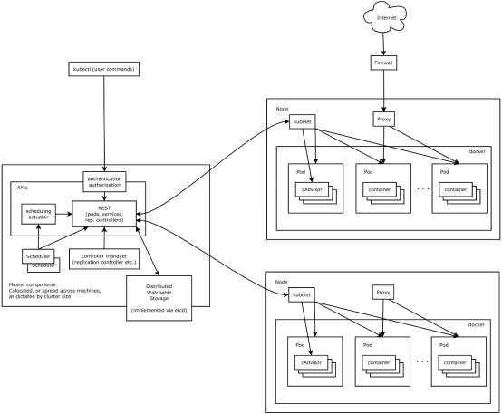

##### **一.1.1.1.1.** ***\*Kubernetes\*******\*开源的容器集群管理系统\****

**1、*****\*概述\****

本项目使用kubernetes将本地服务器、云服务器以及三方虚拟服务器组成混合云架构。实现统一部署、规划、更新、维护。

kubernetes，简称K8s，是用8代替8个字符“ubernete”而成的缩写。是一个开源的，用于管理云平台中多个主机上的容器化的应用，Kubernetes的目标是让部署容器化的应用简单并且高效（powerful）,Kubernetes提供了应用部署，规划，更新，维护的一种机制。

**2、*****\*功能与作用\****

​       传统的应用部署方式是通过插件或脚本来安装应用。这样做的缺点是应用的运行、配置、管理、所有生存周期将与当前操作系统绑定，这样做并不利于应用的升级更新/回滚等操作，当然也可以通过创建虚拟机的方式来实现某些功能，但是虚拟机非常重，并不利于可移植性。

新的方式是通过部署容器方式实现，每个容器之间互相隔离，每个容器有自己的文件系统 ，容器之间进程不会相互影响，能区分计算资源。相对于虚拟机，容器能快速部署，由于容器与底层设施、机器文件系统解耦的，所以它能在不同云、不同版本操作系统间进行迁移。

容器占用资源少、部署快，每个应用可以被打包成一个容器镜像，每个应用与容器间成一对一关系也使容器有更大优势，使用容器可以在build或release 的阶段，为应用创建容器镜像，因为每个应用不需要与其余的应用堆栈组合，也不依赖于生产环境基础结构，这使得从研发到测试、生产能提供一致环境。类似地，容器比虚拟机轻量、更“透明”，这更便于监控和管理。

总之Kubernetes是容器集群管理系统，是一个开源的平台，可以实现容器集群的自动化部署、自动扩缩容、维护等功能。

通过Kubernetes可以实现：

（1）服务发现和负载均衡

Kubernetes 可以使用 DNS 名称或自己的 IP 地址公开容器，如果到容器的流量很大，Kubernetes 可以负载均衡并分配网络流量，从而使部署稳定。

（2）存储编排

Kubernetes 允许用户自动挂载用户选择的存储系统，例如本地存储、公共云提供商等。

（3）自动部署和回滚

可以使用 Kubernetes 描述已部署容器的所需状态，它可以以受控的速率将实际状态更改为所需状态。例如，可以自动化 Kubernetes 来为部署创建新容器，删除现有容器并将它们的所有资源用于新容器。

（4）自动二进制打包

Kubernetes 允许指定每个容器所需 CPU 和内存（RAM）。当容器指定了资源请求时，Kubernetes 可以做出更好的决策来管理容器的资源。

（5）自我修复

Kubernetes 重新启动失败的容器、替换容器、Kill不响应用户定义的运行状况检查的容器，并且在准备好服务之前不将其通告给客户端。

（6）密钥与配置管理

Kubernetes 允许存储和管理敏感信息，例如密码、OAuth 令牌和 ssh 密钥。可以在不重建容器镜像的情况下部署和更新密钥和应用程序配置，也无需在堆栈配置中暴露密钥。

Kubernetes 具备完善的集群管理能力，包括多层次的安全防护和准入机制、多租户应用支撑能力、透明的服务注册和服务发现机制、内建负载均衡器、故障发现和自我修复能力、服务滚动升级和在线扩容、可扩展的资源自动调度机制、多粒度的资源配额管理能力。

Kubernetes 还提供完善的管理工具，涵盖开发、部署测试、运维监控等各个环节。

 

（kubenetes架构图）

 

Kubernetes主要由以下几个核心组件组成：

etcd保存了整个集群的状态；

apiserver提供了资源操作的唯一入口，并提供认证、授权、访问控制、API注册和发现等机制；

controller manager负责维护集群的状态，比如故障检测、自动扩展、滚动更新等；

scheduler负责资源的调度，按照预定的调度策略将Pod调度到相应的机器上；

kubelet负责维护容器的生命周期，同时也负责Volume（CVI）和网络（CNI）的管理；

Container runtime负责镜像管理以及Pod和容器的真正运行（CRI）；

kube-proxy负责为Service提供cluster内部的服务发现和负载均衡；

将云服务器和本地服务器上安装Kubernetes组成集群，由Kubernetes对设备进行统一管理，每个节点的设备称为Kubernetes的Node节点，每个节点都包含用于运行 pods 的必要服务，并由主控组件管理。工作节点托管作为应用程序组件的Pod，是可以在 Kubernetes 中创建和管理的、最小的可部署的计算单元。所有的上层应用软件，都将由控制器自动分配Pod执行。

***\*3、\*******\*使用\*******\*Kubernetes\*******\*的必要性\****

1、故障迁移：当某一个node节点关机或挂掉后，node节点上的服务会自动转移到另一个node节点上，这个过程所有服务不中断。这是docker或普通云主机是不能做到的

2、资源调度：当node节点上的cpu、内存不够用的时候，可以扩充node节点，新建的pod就会被kube-schedule调度到新扩充的node节点上

3、资源隔离：创建开发、运维、测试三个命名空间，切换上下文后，开发人员就只能看到开发命名空间的所有pod，看不到运维命名空间的pod，这样就不会造成影响，互不干扰

传统的主机或只有docker环境中，登录进去就会看到所有的服务或者容器

4、因为采用docker容器，进程之间互不影响

5、安全：不同角色有不同的权限，查看pod、删除pod等操作；RBAC认证增加了k8s的安全

快速精准地部署应用程序

限制硬件用量仅为所需资源

可移动： 公有云、私有云、混合云、多态云

可扩展： 模块化、插件化、可挂载、可组合

自修复： 自动部署、自动重启、自动复制、自动伸缩