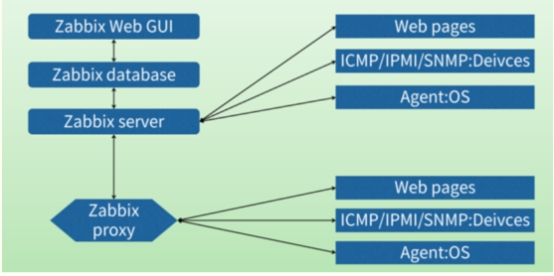
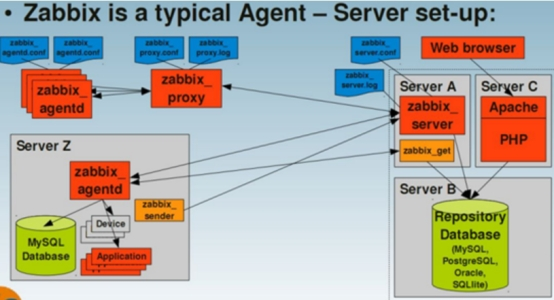

### Zabbix监控

#### 1、概述

​       Zabbix 是企业级开源分布式监控解决方案。

​       Zabbix 是一款软件，可监控网络的众多参数以及服务器、虚拟机、应用程序、服务、数据库、网站、云等的健康状况和完整性。Zabbix 使用灵活的通知机制，允许用户为几乎任何事件配置基于电子邮件、钉钉、短信等的警报。这允许对服务器问题作出快速反应。Zabbix 基于存储的数据提供出色的报告和数据可视化功能。这使得 Zabbix 成为容量规划的理想选择。

Zabbix支持主动轮询和被动捕获。Zabbix所有的报告、统计信息和配置参数都可以通过基于Web的前端页面进行访问。基于Web的前端页面可以确保从任何方面评估网络状态和服务器的健康性。适当的配置后，Zabbix可以在IT基础架构监控方面扮演重要的角色。对于只有少量服务器的小型组织和拥有大量服务器的大型公司同样如此。

 

#### 2、原理与设计

服务器

Zabbix服务器是代理程序报告系统可用性，系统完整性和统计数据的核心组件，是所有配置信息，统计信息和操作数据的核心存储器。

数据库存储

所有配置信息和的Zabbix收集到的数据都被存储在数据库中。

网络界面

为了从任何地方和任何平台都可以轻松地访问Zabbix，我们提供基于Web的Zabbix界面。该界面是Zabbix Server的一部分，通常（但不一定）跟Zabbix Server运行在同一台物理机器上。

代理代理服务器

Zabbix proxy可以替Zabbix Server收集性能和可用性数据.Proxy代理服务器是Zabbix软件可选择部署的一部分；当然，Proxy代理服务器可以帮助单台Zabbix Server分担负载压力。

 

代理监控代理

Zabbix代理监控代理部署在监控目标上，能够主动监控本地资源和应用程序，并将收集到的数据报告给Zabbix服务器。

数据流

Zabbix内部的数据流同样很重要。监控方面，为了创建一个监控项（项）用于采集数据，必须先创建一个主机（主机）。告警方面，在监控项里创建触发器（扳机） ，因此，你想收到Server X CPU负载过高的告警，你必须：

1.为Server X创建一个主机并关联一个用于对CPU进行监控的监控项（Item）。

2.创建一个Trigger，设置成当CPU负载过高时会触发

3.触发被触发，发送告警邮件虽然看起来有很多步骤，但是使用模板的话操作起来其实很简单， ZABBIX这样的设计使得配置机制非常灵活易用。

 

###### 架构图

 

Zabbix Server：负责接收Agent发送的报告信息，组织所有配置、数据和操作。

Database Storage：存储配置信息以及收集到的数据。

Web Interface：Zabbix的GUI 接口，通常与Server运行在同一台机器上。

Proxy：可选组件，常用于分布式监控环境中。

Agent：部署在被监控主机上，负责收集数据发送给Server。

 

###### Zabbix的工作流程

Agent获取被监控端数据，发送给Server。

Server记录所接收到的数据，存储在Database中并按照策略进行相应操作。

如果是分布式，Server会将数据传送一份到上级Server中。

Web Interface将收集到的数据和操作信息显示给用户。

 

###### Zabbix的进程

默认情况下zabbix包含5个程序：zabbix_agentd、zabbix_get、zabbix_proxy、zabbix_sender、zabbix_server，另外一个zabbix_java_gateway是可选，这个需要另外安装。下面来分别介绍下他们各自的作用。

zabbix_agentd客户端守护进程，此进程收集客户端数据，例如CPU负载、内存、硬盘使用情况等。

zabbix_getzabbix工具，单独使用的命令，通常在server或者proxy端执行获取远程客户端信息的命令。通常用户排错。例如在server端获取不到客户端的内存数据，我们可以使用zabbix_get获取客户端的内容的方式来做故障排查。

zabbix_senderzabbix工具，用于发送数据给server或者proxy，通常用于耗时比较长的检查。很多检查非常耗时间，导致zabbix超时。于是我们在脚本执行完毕之后，使用sender主动提交数据。

zabbix_serverzabbix服务端守护进程。zabbix_agentd、zabbix_get、zabbix_sender、zabbix_proxy、zabbix_java_gateway的数据最终都是提交到server

 

逻辑关系图

 

 

#### 3、功能与作用

Zabbix是一种高度集成的网络监控，具备常见的监控的所有功能。如主机的性能监控、网络设备性能监控、数据库性能监控、FTP等通用协议监控、多种告警方式、详细的报表图表绘制、分布式、可扩展能力、API等。

 

1、数据收集

可用性能检测

支持Agrent、SNMP（包括Trapping和Polling)、IPMI、JMX、SSH、Telnet等。

自定义检测

自定义收集数据的频率

服务器端/代理端和客户端模式

2、灵活的触发器

可以定义非常灵活的告警阈值和多种告警相关联的条件

3、高度可定制的告警

发送通知，可定制包括告警级别、动作升级、收件人和媒体类型

通知可以使用全局宏变量和自定义的变量

自动处理功能包括远程命令和自动调节和执行

4、实时的绘图功能

监控项将数据实时绘制在图形上

5、WEB监控能力

Zabbix可以模拟浏览器请求一个网站，并检查返回值和响应时间

6、多种可视化的展示

可以自定义监控的展示图，将多种监控数据集中展示到一张图中

网络拓扑图

自定义的screens和slide shows 可以将多种图形集中展示

报表功能

资源使用情况的监控展示

7、历史数据的存储

数据存储在数据库中

历史数据的存放周期可配置

定期删除过期的历史数据

8、配置非常容易

配置比较简单，只需要配置两步即可

第一步：添加设备

第二步：应用模板即可完成监控

9、使用模板

模板可以分组

模板具有可继承性

10、网络发现

支持自动发现网络设备和服务器（可以通过配置自动发现服务规划实现）

Agent自动注册

支持自动发现（Low level discovery）实现动态监控项的批量监控（支持自定义），内置的自动发现包括文件系统、网络接口、SNMP OID，可定制自动发现。

11、快速的访问接口

WEB页面基于PHP

远程访问

日志审计

12、API功能

应用API功能可以方便地和其他系统结合，包括手机客户端的使用

13、系统权限

不用的用户展示监控的资源不同

对用户的身份认证

14、程序特性

用C语言编写，其性能和内存开销非常小

15、大型环境的支持

利用zabbix-proxy方式即可轻松构建远程监控

 

#### 4、必要性

掌控基础环境

通过CPU的利用率、系统的负载、服务的运行、端口的连通、带宽流量等对服务器设备进行监控

服务的安全运营

Zabbix能监控各种的网络参数，保证服务器系统的安全运营。

 

问题及时定位处理

提供灵活的通知机制于服务器设备的参数，让系统管理员快速定位/解决存在的各种问题。