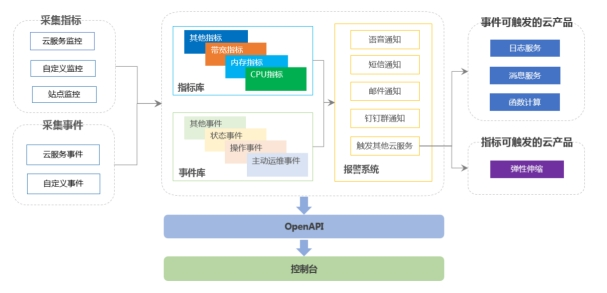

***\*云监控\****

***\*1、概述\****

云监控为云上用户提供企业级开放型一站式监控解决方案。云监控涵盖IT设施基础监控和外网网络质量拨测监控，是基于事件、自定义指标和日志的业务监控，为您全方位提供更高效、全面的监控服务。

云监控通过提供跨云服务和跨地域的应用分组管理模型和报警模板，帮助您快速构建支持几十种云服务、管理数万实例的高效监控报警管理体系。

 

***\*2、原理与设计\****

云监控用于监控各云服务资源的监控指标，探测云服务和运营商站点的可用性，并针对指定监控指标设置报警。使您全面了解云上资源的使用情况和业务运行状况，并及时对故障资源进行处理，保证业务正常运行。

 

***\*架构图\****

 

 

***\*3、功能与作用\****

云监控支持的功能与作用如下表所示。

 

| ***\*功能\****                     | ***\*说明\****                                               |
| ---------------------------------- | ------------------------------------------------------------ |
| [Dashboard](#concept-od3-d4y-5db)  | 为您提供自定义查看监控数据的功能。您可以在一个监控大盘中跨云服务、跨实例查看监控数据。 |
| [应用分组](#concept-c43-vcv-vdb)   | 为您提供跨云服务、跨地域的资源分组管理功能。支持您从业务角度集中管理服务器、数据库、负载均衡、存储等资源，从而按实际业务需求来管理报警规则，查看监控数据，提升运维效率。 |
| [主机监控](#concept-ypb-thv-vdb)   | 主机监控通过在云主机上安装插件，监控主机的CPU、内存、磁盘、网络等监控项，并对所有监控项提供报警功能。 |
| [事件监控](#concept-idt-k3b-wdb)   | 为您提供事件的上报、查询、报警功能，方便您将业务中的各类异常事件或重要变更事件收集上报到云监控，并在异常发生时接收报警。 |
| [自定义监控](#concept-oq3-h3b-wdb) | 您可以针对自己关心的业务指标设置自定义监控，将采集到的监控数据上报至云监控，由云监控进行数据处理，并根据处理结果进行报警。 |
| [日志监控](#concept-l3t-gkb-wdb)   | 为您提供日志数据实时分析、监控图表可视化展示和报警功能。您只需要开通日志服务，将本地日志通过日志服务进行收集，即可解决企业的监控运维与运营诉求。此外，日志服务还可完美结合云监控的主机监控、云服务监控、站点监控、应用分组、Dashboard和报警服务，形成完整的监控闭环。 |
| [站点监控](#concept-eff-yjb-wdb)   | 为您提供互联网网络探测的监控服务，主要用于通过遍布全国的互联网终端节点，发送模拟真实用户访问的探测请求，监控全国各省市运营商网络的终端用户到服务站点的访问情况。 |
| [云产品监控](#task-1930878)        | 为您提供监控当前阿里云账号下各云服务资源的功能。您可以查看各云服务的监控图表，了解资源的运行状况。您也可以通过设置报警规则，帮助您监控资源的运行状况。当符合报警规则时，云监控自动发送报警通知，便于您及时获悉资源的运行状况。 |
| [报警服务](#concept-dcs-dsm-vdb)   | 为您提供监控数据的报警功能。您可以通过设置报警规则来定义监控项的阈值，并在监控项满足报警条件时发送报警通知。您对重要监控项设置报警规则后，可在第一时间得知该监控项异常，迅速处理故障。 |
| [资源消耗](#concept-wgn-d5c-5db)   | 为您提供查看资源消耗详情的功能，您也可以购买短信资源包或电话报警资源包。 |
| [容器监控](#concept-2010031)       | 为您提供跨地域、集中化和全局化监控容器服务Kubernetes版集群的功能。 |

 

***\*4、必要性\****

***\*基础监控\****

云上云下统一的主机监控解决方案及百余款云产品监控。

主机监控

通过在主机上安装插件，为您的主机提供监控功能。无论您的主机是云服务器ECS，还是其他云厂商的虚拟机或物理机，都可以使用云监控的主机监控功能。

云产品监控

提供涵盖弹性计算、网络、数据库、存储、大数据、安全及中间件等百余款云产品的数千指标及数百事件的监控报警。

 

***\*网络监控\****

基于私网和公网的网络可用性监控。

站点监控

通过遍布全国的互联网终端节点，发送模拟真实用户访问的探测请求，监控全国各省市运营商网络终端用户到您服务站点的访问情况。

可用性监控

针对VPC网络，利用在目标网络环境中，已经安装了插件的主机作为探测点，探测自身或相关服务的可用性。

 

***\*业务监控\****

通过日志监控、自定义监控把业务数据归集到云上进行统一监控和管理。

日志监控

提供对日志数据实时分析、监控图表可视化展示和报警服务。您只需要开通日志服务，将本地日志通过日志服务进行收集，即可解决企业的监控运维与运营诉求。

自定义监控

通过上报监控数据，将业务指标发送至云监控，并在云监控上添加监控图标和设置报警规则，对于故障指标发送报警通知，便于您及时处理故障，保障业务的正常运行。

自定义事件

通过上报自定义事件，将业务产生的异常事件采集发送到云监控，通过对上报的事件配置报警规则来接收报警通知。