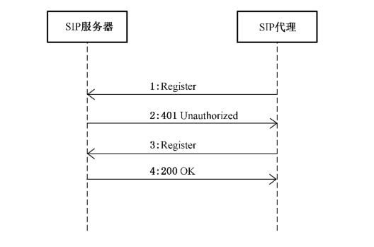
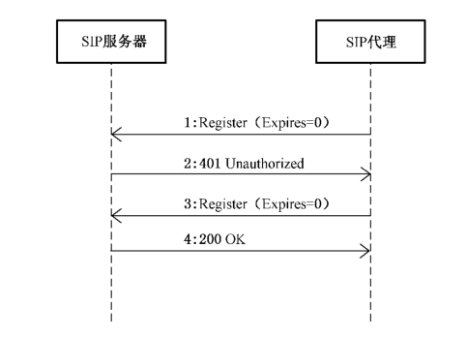
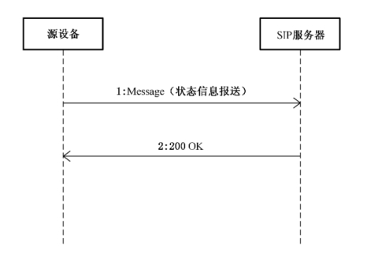
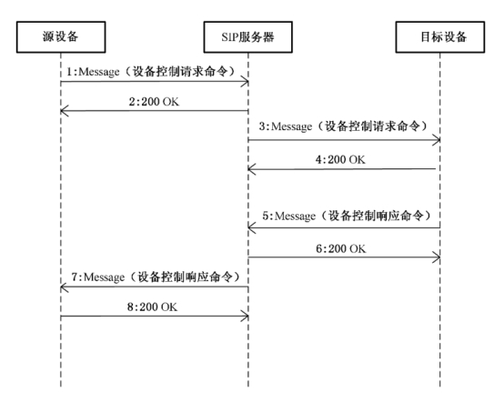
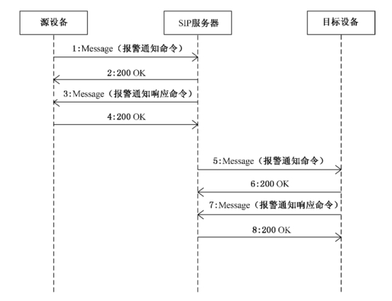
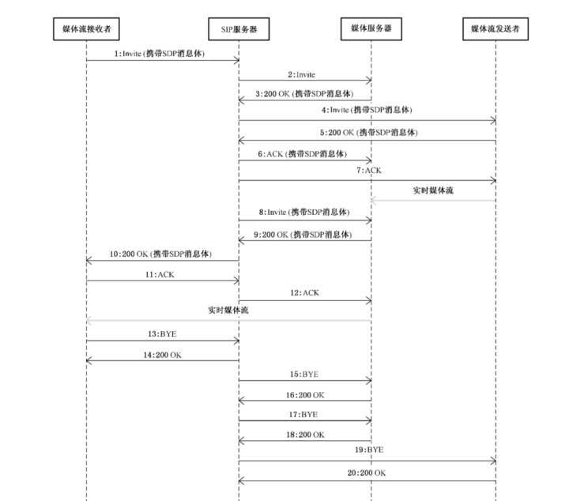
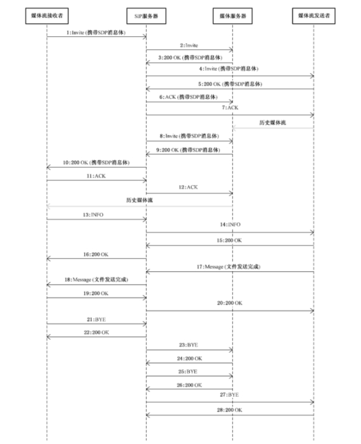
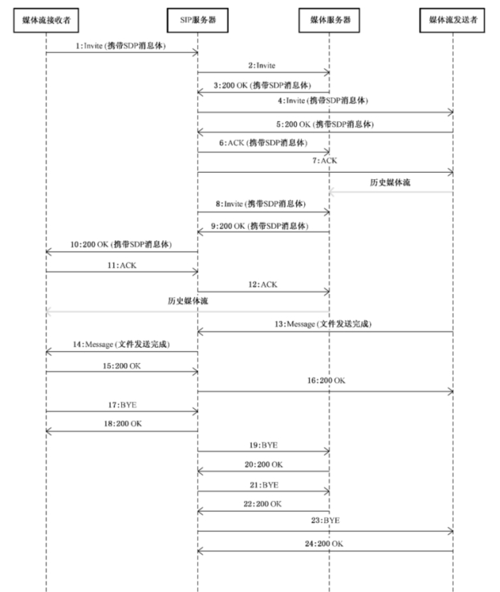

SIP信令模块主要根据GB/T28181标准封装的一套视频监控管理控制模块，主要用于前端数据采集设备的管理和控制。

 

SIP信令模块的详细功能要求，包含且不限以下内容

| 一级目录   | 二级目录   | 功能描述                                         |
| ---------- | ---------- | ------------------------------------------------ |
| 设备管理   | 注册和注销 | 设备的离在线管理，设备云台控制和报警通知订阅管理 |
| 状态信息   |            |                                                  |
| 设备控制   |            |                                                  |
| 订阅和通知 |            |                                                  |
| 音视频管理 | 实时预览   | 远程查看和下载设备的音视频内容                   |
| 历史回放   |            |                                                  |
| 音视频下载 |            |                                                  |

 

设备的基本注册、注销即采用 IETFRFC3261 规定的基于数字摘要的挑战应答式安全技术进行注册。

 

（基本注册流程图）

 

（基本注销流程图）

 

设备的状态信息主要通过心跳机制同步，心跳发送方、接收方需统一配置“心跳间隔”参数，按照“心跳间隔”定时发送心跳消息，默认心跳间隔 60s。心跳发送方、接收方需统一配置“心跳超时次数”参数，心跳消息连续超时达到“心跳超时次数”则认为对方下线，默认心跳超时次数 3 次。状态信息报送采用 IETFRFC3428 中定义的方法 Message 实现。

 

（状态信息报送流程图）

控制的类型包括云台控制、远程启动、录像控制、报警布防/撤防、报警复位、强制关键帧、拉框放大、拉框缩小、看守位控制、设备配置等，设备控制采用IETFRFC3428中的Message方法实现。

 

（设备控制流程图）

设备的订阅和通知是指发生报警事件时，源设备应将报警信息发送给 SIP 服务器； SIP 服务器接收到报警事件后，将报警信息分发给目标设备。报警事件通知和分发使用 IETFRFC3428 中定义的方法 Message 传送报警信息。

 

（订阅通知流程图）

设备的实时预览是指将设备实时采集到的数据转化为数据流，通过流媒体服务器将数据转发给媒体接受者查看。实时视音频点播采用 SIP 协议(IETFRFC3261 )中的 Invite 方法实现会话连接，采用 RTP / RTCP协议(IETFRFC3550 )实现媒体传输。

 

（实时预览流程图）

设备的历史视频回放是指将设备存储在本地的历史数据转化为流的形式，通过流媒体服务器将数据转发给媒体接受者查看。应采用 SIP 协议(IETFRFC3261 )中的 Invite 方法实现会话连接，采用 SIP 扩展协议( IETFRFC2976 ) Info 方法的消息体携带视音频回放控制命令，采用 RTP / RTCP 协议( IETFRFC3550 )实现媒体传输。

 

（历史回放流程图）

设备视频文件下载是指SIP 服务器接收到媒体接收者发送的视音频文件下载请求后向媒体流发送者发送媒体文件下载命令，媒体流发送者采用 RTP 将视频流传输给媒体流接收者，媒体流接收者直接将视频流保存为媒体文件。媒体流接收者可以是用户客户端或联网系统，媒体流发送者可以是媒体设备或联网系统。

 

（视频下载流程图）